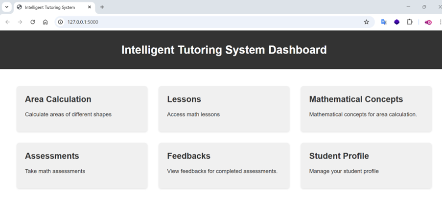
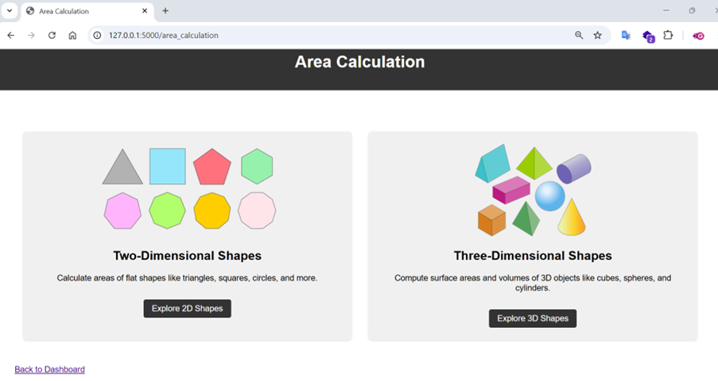
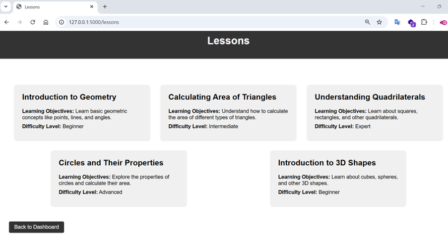
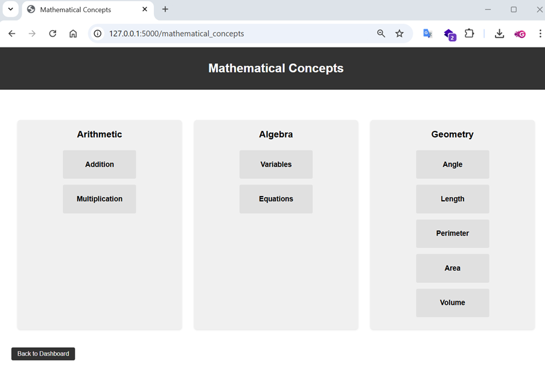
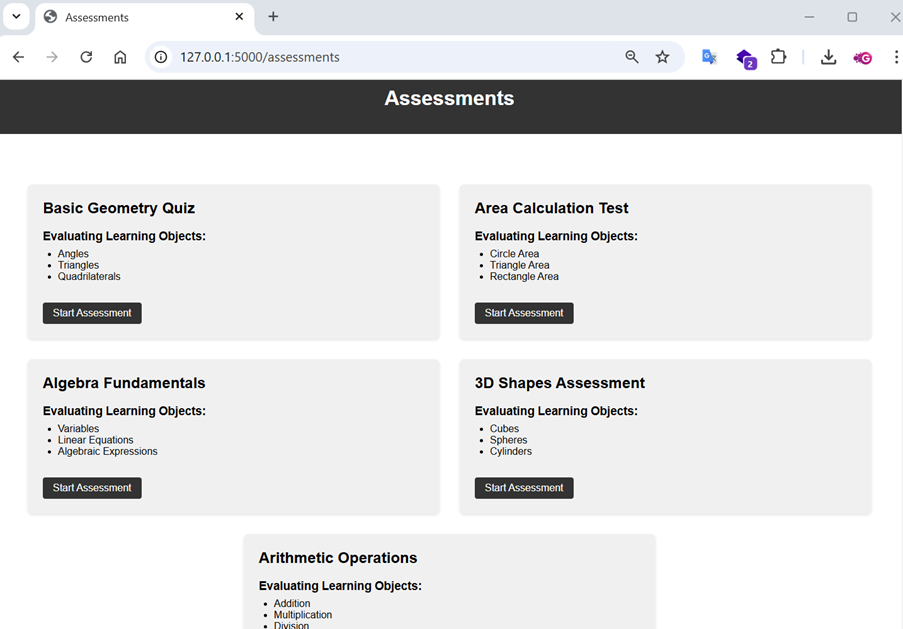
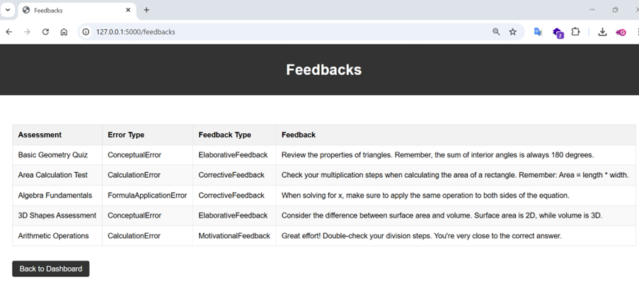

This repositary contains source code of interfaces which implemented for Intelligent Tutoring System (ITS) for Math to calculate the area of different shapes.

## Dashboard Page

## Area Calculation Page

## Lessons Page

## Math Concepts Page

## Assessments Page

## Feedback Page

## Profile Page
